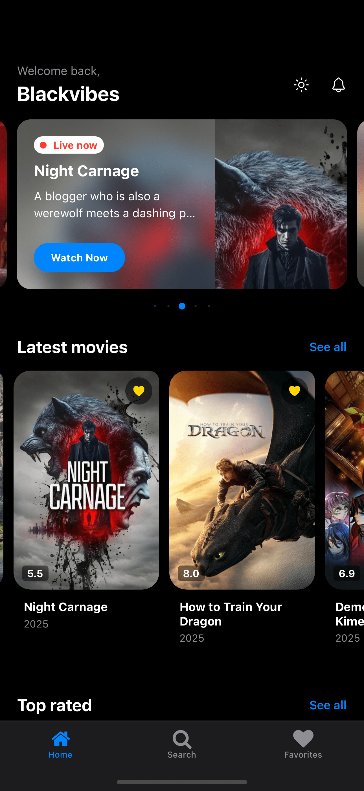
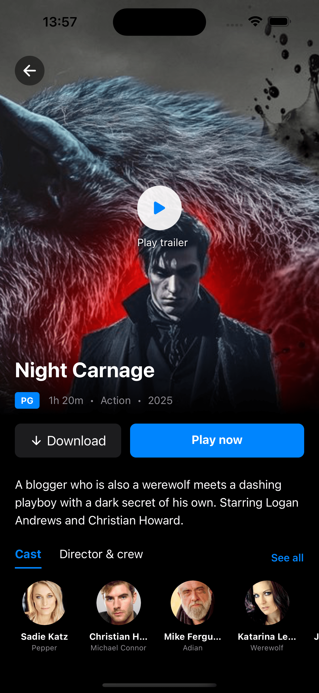
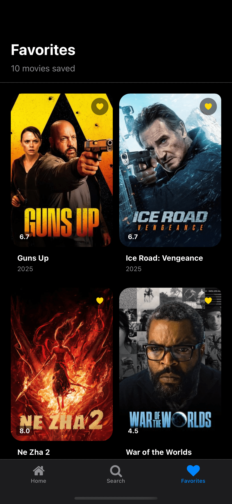
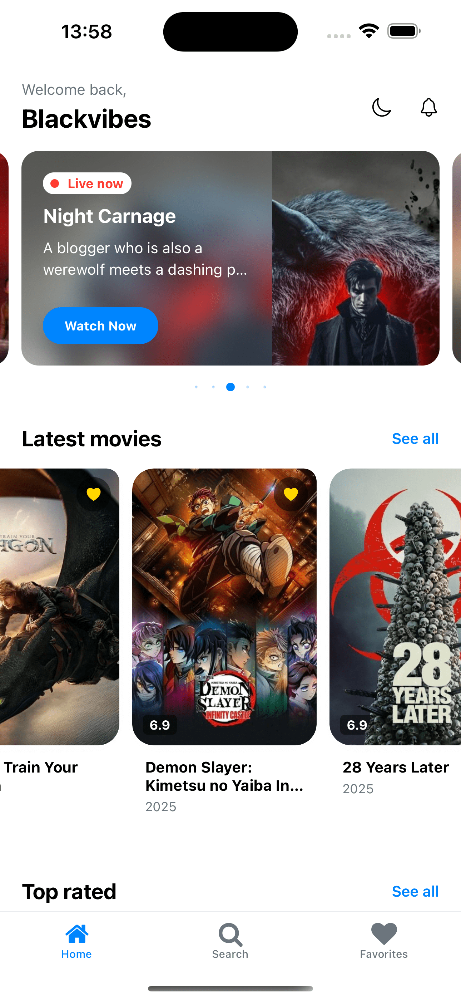

# MovieApp - React Native Movie Application (Assessment)

A modern, cross-platform movie application built with React Native, Expo Router, and TypeScript. The app allows users to browse popular movies, search for content, view detailed information, and save favorites locally.

---

## 📱 App Preview

<div align="center">
  
  
  
  
</div>

---

## 🎬 Features

### Core Features
- **Home Screen**: Browse popular movies with a beautiful card-based layout
- **Search Functionality**: Real-time search with debounced API calls
- **Movie Details**: Comprehensive movie information including cast, crew, and trailers
- **Favorites System**: Save and manage favorite movies locally
- **Dark/Light Mode**: Toggle between themes with persistent storage
- **Onboarding**: Welcome screen for first-time users

### Technical Features
- **Zustand State Management**: Efficient and lightweight state management
- **TypeScript**: Full type safety throughout the application
- **React Native Reanimated**: Smooth animations and transitions
- **Expo Router**: File-based routing with bottom tab navigation
- **NativeWind**: Utility-first styling with Tailwind CSS
- **AsyncStorage**: Local data persistence for favorites and settings
- **TMDb API Integration**: Real movie data from The Movie Database

## 🚀 Getting Started

### Prerequisites
- Node.js (v16 or higher)
- Yarn or npm
- Expo CLI
- iOS Simulator or Android Emulator (optional)

### Installation

1. **Clone the repository**
   ```bash
   git clone <repository-url>
   cd mephalti-assessment
   ```

2. **Install dependencies**
   ```bash
   yarn install
   ```

3. **Set up TMDb API Key**
   - Sign up for a free account at [The Movie Database](https://www.themoviedb.org/settings/api)
   - Get your API key from the settings
   - Open `store/movieStore.ts`
   - Replace `'your_tmdb_api_key_here'` with your actual API key

4. **Start the development server**
   ```bash
   yarn start
   ```

5. **Run on your device/simulator**
   - Press `i` for iOS simulator
   - Press `a` for Android emulator
   - Scan QR code with Expo Go app on your phone

## 📱 App Structure

```
mephalti-assessment/
├── app/
│   ├── (tabs)/
│   │   ├── _layout.tsx          # Tab navigation configuration
│   │   ├── index.tsx            # Home screen
│   │   ├── search.tsx           # Search screen
│   │   └── favorites.tsx        # Favorites screen
│   ├── _layout.tsx              # Root layout with onboarding
│   ├── onboarding.tsx           # Welcome screen
│   └── movie-details.tsx        # Movie details screen
├── components/
│   ├── MovieCard.tsx            # Reusable movie card component
│   ├── LoadingSpinner.tsx       # Loading animation component
│   └── ErrorMessage.tsx         # Error state component
├── store/
│   └── movieStore.ts            # Zustand store with API integration
├── constants/
│   └── Theme.ts                 # Theme configuration
└── assets/                      # Images and fonts
```

## 🏗️ Architecture

### State Management (Zustand)
The app uses Zustand for state management with the following structure:
- **Theme State**: Dark/light mode toggle with persistence
- **Movie Data**: Popular movies, search results, and movie details
- **Favorites**: Local storage of user's favorite movies
- **Loading States**: API call status management
- **Error Handling**: Centralized error state management

### API Integration
- **TMDb API**: Fetches real movie data including:
  - Popular movies
  - Search results
  - Movie details with cast and crew
  - Movie trailers
- **Image URLs**: Dynamic image loading with different sizes
- **Error Handling**: Graceful fallbacks for failed API calls

### Navigation (Expo Router)
- **File-based Routing**: Automatic route generation
- **Bottom Tab Navigation**: Home, Search, and Favorites
- **Stack Navigation**: Movie details and onboarding screens
- **Deep Linking**: Support for direct navigation to movie details

### Styling (base stylesheet)
<!-- - **Utility-first CSS**: Rapid UI development -->
- **Theme System**: Consistent colors and spacing
<!-- - **Responsive Design**: Adapts to different screen sizes -->
- **Dark Mode**: Complete theme switching

## 🎨 UI/UX Features

### Design System
- **Consistent Theming**: Unified color palette and typography
- **Card-based Layout**: Modern, clean interface
- **Smooth Animations**: Reanimated-powered transitions
- **Loading States**: Engaging loading animations
- **Error States**: User-friendly error messages

### User Experience
- **Onboarding Flow**: Guided first-time user experience
- **Persistent Preferences**: Remembers theme and favorites
- **Offline Support**: Cached data for better performance
- **Accessibility**: Proper contrast and touch targets

## 🔧 Configuration

### API Configuration
The app is configured to use TMDb API v3. Update the API key in `store/movieStore.ts`:
```typescript
const TMDB_API_KEY = 'your_actual_api_key';
```

## 📦 Dependencies

### Core Dependencies
- `expo`: React Native framework
- `expo-router`: File-based routing
- `react-native-reanimated`: Animation library
- `zustand`: State management
- `axios`: HTTP client
- `@react-native-async-storage/async-storage`: Local storage

### Development Dependencies
- `typescript`: Type safety

**Note**: Make sure to replace the TMDb API key with your own before running the application. The current placeholder will not work for API calls. 